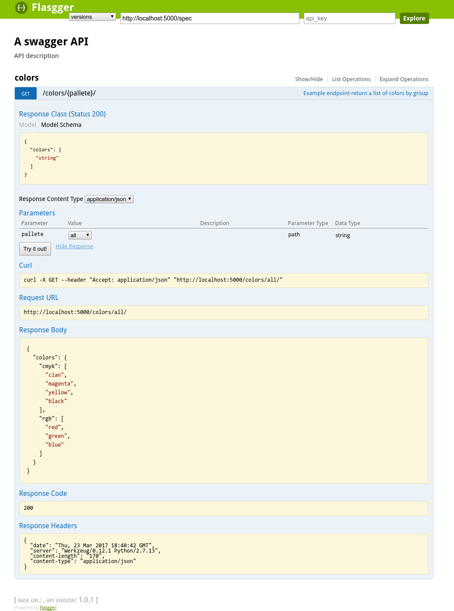

# Flasgger
## Easy Swagger UI for your Flask API

[](https://travis-ci.org/rochacbruno/flasgger)
[](https://landscape.io/github/rochacbruno/flasgger/master)
[](https://coveralls.io/github/rochacbruno/flasgger?branch=master)
[](https://pypi.python.org/pypi/flasgger)
 <a target="_blank" href="https://www.paypal.com/cgi-bin/webscr?cmd=_donations&amp;business=rochacbruno%40gmail%2ecom&amp;lc=BR&amp;item_name=Flasgger&amp;no_note=0&amp;currency_code=USD&amp;bn=PP%2dDonationsBF%3abtn_donate_SM%2egif%3aNonHostedGuest"></a>


Flasgger is a Flask extension to **extract [OpenAPI=Specification](https://github.com/OAI/OpenAPI-Specification/blob/master/versions/2.0.md#operation-object)** from all Flask views registered in your API.

Flasgger also comes with **[SwaggerUI](http://swagger.io/swagger-ui/) embedded** so you can access [http://localhost:5000/apidocs](localhost:5000/apidocs) and visualize and interact with your API resources.

Flasgger also **provides validation** of the incoming data, using the same specification it can validates if the data received as as a POST, PUT, PATCH is valid against the schema defined using **YAML**, **Python dictionaries** or **Marshmallow Schemas**.

Flasgger can work with simple function views or MethodViews using docstring as specification, or using `@swag_from` decorator to get specification from **YAML** or **dict** and also provides **SwaggerView** which can use **Marshmallow Schemas**  as specification.

Flasgger is compatible with `Flask-RESTful` so you can use `Resources` and `swag` specifications together, take a look at [restful example.](examples/restful.py)

Flasgger also supports `Marshmallow APISpec` as base template for specification, if you are using APISPec from Marshmallow take a look at [apispec example.](examples/apispec_example.py)

# Examples and demo app

There are some [example applications](examples/) and you can also play with examples in [Flasgger demo app](http://flasgger.pythonanywhere.com/)

> NOTE: all the examples apps are also test cases and run automatically in Travis CI to ensure quality and coverage.

## Docker

The examples and demo app can also be built and run as a Docker image/container:

```
docker build -t flasgger .
docker run -it --rm -p 5000:5000 --name flasgger flasgger
```
Then access the Flasgger demo app at http://localhost:5000 .

# Installation

> under your virtualenv do:

Ensure you have latest setuptools
```
pip install -U setuptools
```

then

```
pip install flasgger
```

or (dev version)

```
pip install https://github.com/rochacbruno/flasgger/tarball/master
```

> NOTE: If you want to use **Marshmallow Schemas** you also need to run `pip install marshmallow apispec`

# Getting started

## Using docstrings as specification

Create a file called for example `colors.py`

```python
from flask import Flask, jsonify
from flasgger import Swagger

app = Flask(__name__)
swagger = Swagger(app)

@app.route('/colors/<palette>/')
def colors(palette):
    """Example endpoint returning a list of colors by palette
    This is using docstrings for specifications.
    ---
    parameters:
      - name: palette
        in: path
        type: string
        enum: ['all', 'rgb', 'cmyk']
        required: true
        default: all
    definitions:
      Palette:
        type: object
        properties:
          palette_name:
            type: array
            items:
              $ref: '#/definitions/Color'
      Color:
        type: string
    responses:
      200:
        description: A list of colors (may be filtered by palette)
        schema:
          $ref: '#/definitions/Palette'
        examples:
          rgb: ['red', 'green', 'blue']
    """
    all_colors = {
        'cmyk': ['cian', 'magenta', 'yellow', 'black'],
        'rgb': ['red', 'green', 'blue']
    }
    if palette == 'all':
        result = all_colors
    else:
        result = {palette: all_colors.get(palette)}

    return jsonify(result)

app.run(debug=True)
```

Now run:

```
python colors.py
```

And go to: [http://localhost:5000/apidocs/](http://localhost:5000/apidocs/)

You should get:



## Using external YAML files

Save a new file `colors.yml`

```yaml
Example endpoint returning a list of colors by palette
In this example the specification is taken from external YAML file
---
parameters:
  - name: palette
    in: path
    type: string
    enum: ['all', 'rgb', 'cmyk']
    required: true
    default: all
definitions:
  Palette:
    type: object
    properties:
      palette_name:
        type: array
        items:
          $ref: '#/definitions/Color'
  Color:
    type: string
responses:
  200:
    description: A list of colors (may be filtered by palette)
    schema:
      $ref: '#/definitions/Palette'
    examples:
      rgb: ['red', 'green', 'blue']
```


lets use the same example changing only the view function.

```python
from flasgger import swag_from

@app.route('/colors/<palette>/')
@swag_from('colors.yml')
def colors(palette):
    ...
```

If you do not want to use the decorator you can use the docstring `file:` shortcut.

```python
@app.route('/colors/<palette>/')
def colors(palette):
    """
    file: colors.yml
    """
    ...
```


## Using dictionaries as raw specs

Create a Python dictionary as:

```python
specs_dict = {
  "parameters": [
    {
      "name": "palette",
      "in": "path",
      "type": "string",
      "enum": [
        "all",
        "rgb",
        "cmyk"
      ],
      "required": "true",
      "default": "all"
    }
  ],
  "definitions": {
    "Palette": {
      "type": "object",
      "properties": {
        "palette_name": {
          "type": "array",
          "items": {
            "$ref": "#/definitions/Color"
          }
        }
      }
    },
    "Color": {
      "type": "string"
    }
  },
  "responses": {
    "200": {
      "description": "A list of colors (may be filtered by palette)",
      "schema": {
        "$ref": "#/definitions/Palette"
      },
      "examples": {
        "rgb": [
          "red",
          "green",
          "blue"
        ]
      }
    }
  }
}
```

Now take the same function and use the dict in the place of YAML file.

```python
@app.route('/colors/<palette>/')
@swag_from(specs_dict)
def colors(palette):
    """Example endpoint returning a list of colors by palette
    In this example the specification is taken from specs_dict
    """
    ...
```

## Using Marshmallow Schemas

> FIRST: `pip install marshmallow apispec`

```python
from flask import Flask, jsonify
from flasgger import Swagger, SwaggerView, Schema, fields


class Color(Schema):
    name = fields.Str()

class Palette(Schema):
    pallete_name = fields.Str()
    colors = fields.Nested(Color, many=True)

class PaletteView(SwaggerView):
    parameters = [
        {
            "name": "palette",
            "in": "path",
            "type": "string",
            "enum": ["all", "rgb", "cmyk"],
            "required": True,
            "default": "all"
        }
    ]
    responses = {
        200: {
            "description": "A list of colors (may be filtered by palette)",
            "schema": Palette
        }
    }

    def get(self, palette):
        """
        Colors API using schema
        This example is using marshmallow schemas
        """
        all_colors = {
            'cmyk': ['cian', 'magenta', 'yellow', 'black'],
            'rgb': ['red', 'green', 'blue']
        }
        if palette == 'all':
            result = all_colors
        else:
            result = {palette: all_colors.get(palette)}
        return jsonify(result)

app = Flask(__name__)
swagger = Swagger(app)

app.add_url_rule(
    '/colors/<palette>',
    view_func=PaletteView.as_view('colors'),
    methods=['GET']
)

app.run(debug=True)

```

> NOTE: take a look at `examples/validation.py` for a more complete example.


> NOTE: when catching arguments in path rule always use explicit types, bad: ``/api/<username>`` good: ``/api/<string:username>``


## Using **Flask RESTful** Resources

Flasgger is compatible with Flask-RESTful you only need to install `pip install flask-restful` and then:

```python

from flask import Flask
from flasgger import Swagger
from flask_restful import Api, Resource

app = Flask(__name__)
api = Api(app)
swagger = Swagger(app)

class Username(Resource):
    def get(self, username):
       """
       This examples uses FlaskRESTful Resource
       It works also with swag_from, schemas and spec_dict
       ---
       parameters:
         - in: path
           name: username
           type: string
           required: true
       responses:
         200:
           description: A single user item
           schema:
             id: User
             properties:
               username:
                 type: string
                 description: The name of the user
                 default: Steven Wilson
        """
        return {'username': username}, 200


api.add_resource(Username, '/username/<username>')

app.run(debug=True)

```

## Auto-parsing external YAML docs and `MethodView`s

Flasgger can be configured to auto-parse external YAM API docs.  [Set a `doc_dir`](https://github.com/rochacbruno/flasgger/blob/aaef05c17cc559d01b7436211093463642eb6ae2/examples/parsed_view_func.py#L16) in your `app.config['SWAGGER']` and Swagger will load API docs by looking in `doc_dir` for YAML files stored by endpoint-name and method-name.  For example, `'doc_dir': './examples/docs/'` and a file `./examples/docs/items/get.yml` will provide a Swagger doc for `ItemsView` method `get`.

Additionally, when using **Flask RESTful** per above, by passing `parse=True` when constructing `Swagger`, Flasgger will use  `flask_restful.reqparse.RequestParser`, locate all `MethodView`s and parsed and validated data will be stored in `flask.request.parsed_data`.

## Handling multiple http methods and routes for a single function

You can separate specifications by endpoint or methods

```python
from flasgger.utils import swag_from

@app.route('/api/<string:username>', endpoint='with_user_name', methods=['PUT', 'GET'])
@app.route('/api/', endpoint='without_user_name')
@swag_from('path/to/external_file.yml', endpoint='with_user_name')
@swag_from('path/to/external_file_no_user_get.yml', endpoint='without_user_name', methods=['GET'])
@swag_from('path/to/external_file_no_user_put.yml', endpoint='without_user_name', methods=['PUT'])
def fromfile_decorated(username=None):
    if not username:
        return "No user!"
    return jsonify({'username': username})
```

And the same can be achieved with multiple methods in a `MethodView` or `SwaggerView` by
registering the `url_rule` many times. Take a look at `examples/example_app`


# Use the same data to validate your API POST body.

Setting `swag_from`'s _validation_ parameter to `True` will validate incoming data automatically:

```python
from flasgger import swag_from

@swag_from('defs.yml', validation=True)
def post():
    # if not validate returns ValidationError response with status 400
    # also returns the validation message.
```

Using `swagger.validate` annotation is also possible:

```python
from flasgger import Swagger

swagger = Swagger(app)

@swagger.validate('UserSchema')
def post():
    '''
    file: defs.yml
    '''
    # if not validate returns ValidationError response with status 400
    # also returns the validation message.
```

Yet you can call `validate` manually:

```python
from flasgger import swag_from, validate

@swag_from('defs.yml')
def post():
    validate(request.json, 'UserSchema', 'defs.yml')
    # if not validate returns ValidationError response with status 400
    # also returns the validation message.
```

It is also possible to define `validation=True` in `SwaggerView` and also use
`specs_dict` for validation.

Take a look at `examples/validation.py` for more information.

All validation options can be found at http://json-schema.org/latest/json-schema-validation.html

### Custom validation

By default Flasgger will use [python-jsonschema](https://python-jsonschema.readthedocs.io/en/latest/)
to perform validation.

Custom validation functions are supported as long as they meet the requirements:
 - take two, and only two, positional arguments:
    - the data to be validated as the first; and
    - the schema to validate against as the second argument
 - raise any kind of exception when validation fails.

Any return value is discarded.


Providing the function to the Swagger instance will make it the default:

```python
from flasgger import Swagger

swagger = Swagger(app, validation_function=my_validation_function)
```

Providing the function as parameter of `swag_from` or `swagger.validate`
annotations or directly to the `validate` function will force it's use
over the default validation function for Swagger:

```python
from flasgger import swag_from

@swag_from('spec.yml', validation=True, validation_function=my_function)
...
```

```python
from flasgger import Swagger

swagger = Swagger(app)

@swagger.validate('Pet', validation_function=my_function)
...
```

```python
from flasgger import validate

...

    validate(
        request.json, 'Pet', 'defs.yml', validation_function=my_function)
```

### Validation Error handling

By default Flasgger will handle validation errors by aborting the
request with a 400 BAD REQUEST response with the error message.

A custom validation error handling function can be provided to
supersede default behavior as long as it meets the requirements:
 - take three, and only three, positional arguments:
    - the error raised as the first;
    - the data which failed validation as the second; and
    - the schema used in to validate as the third argument


Providing the function to the Swagger instance will make it the default:

```python
from flasgger import Swagger

swagger = Swagger(app, validation_error_handler=my_handler)
```

Providing the function as parameter of `swag_from` or `swagger.validate`
annotations or directly to the `validate` function will force it's use
over the default validation function for Swagger:

```python
from flasgger import swag_from

@swag_from(
    'spec.yml', validation=True, validation_error_handler=my_handler)
...
```

```python
from flasgger import Swagger

swagger = Swagger(app)

@swagger.validate('Pet', validation_error_handler=my_handler)
...
```

```python
from flasgger import validate

...

    validate(
        request.json, 'Pet', 'defs.yml',
        validation_error_handler=my_handler)
```

Examples of use of a custom validation error handler function can be
found at [example validation_error_handler.py](examples/validation_error_handler.py)

# Get defined schemas as python dictionaries

You may wish to use schemas you defined in your Swagger specs as dictionaries
without replicating the specification. For that you can use the `get_schema`
method:

```python
from flask import Flask, jsonify
from flasgger import Swagger, swag_from

app = Flask(__name__)
swagger = Swagger(app)

@swagger.validate('Product')
def post():
    """
    post endpoint
    ---
    tags:
      - products
    parameters:
      - name: body
        in: body
        required: true
        schema:
          id: Product
          required:
            - name
          properties:
            name:
              type: string
              description: The product's name.
              default: "Guarana"
    responses:
      200:
        description: The product inserted in the database
        schema:
          $ref: '#/definitions/Product'
    """
    rv = db.insert(request.json)
    return jsonify(rv)

...

product_schema = swagger.get_schema('product')
```

This method returns a dictionary which contains the Flasgger schema id,
all defined parameters and a list of required parameters.

# HTML sanitizer

By default Flasgger will try to sanitize the content in YAML definitions
replacing every ```\n``` with ```<br>``` but you can change this behaviour
setting another kind of sanitizer.

```python
from flasgger import Swagger, NO_SANITIZER

app =Flask()
swagger = Swagger(app, sanitizer=NO_SANITIZER)
```

You can write your own sanitizer

```python
swagger = Swagger(app, sanitizer=lambda text: do_anything_with(text))
```

There is also a Markdown parser available, if you want to be able to render
Markdown in your specs description use **MK_SANITIZER**


# Swagger UI and templates

You can override the `templates/flasgger/index.html` in your application and
this template will be the `index.html` for SwaggerUI. Use `flasgger/ui2/templates/index.html`
as base for your customization.

Flasgger supports Swagger UI versions 2 and 3, The version 3 is still experimental but you
can try setting `app.config['SWAGGER']['uiversion']`.

```python
app = Flask(__name__)
app.config['SWAGGER'] = {
    'title': 'My API',
    'uiversion': 3
}
swagger = Swagger(app)

```

## Externally loading Swagger UI and jQuery JS/CSS

Starting with Flasgger 0.9.2 you can specify external URL locations for loading the JavaScript and CSS for the Swagger and jQuery libraries loaded in the Flasgger default templates.  If the configuration properties below are omitted, Flasgger will serve static versions it includes - these versions may be older than the current Swagger UI v2 or v3 releases.

The following example loads Swagger UI and jQuery versions from unpkg.com:

```
swagger_config = Swagger.DEFAULT_CONFIG
swagger_config['swagger_ui_bundle_js'] = '//unpkg.com/swagger-ui-dist@3/swagger-ui-bundle.js'
swagger_config['swagger_ui_standalone_preset_js'] = '//unpkg.com/swagger-ui-dist@3/swagger-ui-standalone-preset.js'
swagger_config['jquery_js'] = '//unpkg.com/jquery@2.2.4/dist/jquery.min.js'
swagger_config['swagger_ui_css'] = '//unpkg.com/swagger-ui-dist@3/swagger-ui.css'
Swagger(app, config=swagger_config)
```

# Initializing Flasgger with default data.

You can start your Swagger spec with any default data providing a template:

```python
template = {
  "swagger": "2.0",
  "info": {
    "title": "My API",
    "description": "API for my data",
    "contact": {
      "responsibleOrganization": "ME",
      "responsibleDeveloper": "Me",
      "email": "me@me.com",
      "url": "www.me.com",
    },
    "termsOfService": "http://me.com/terms",
    "version": "0.0.1"
  },
  "host": "mysite.com",  # overrides localhost:500
  "basePath": "/api",  # base bash for blueprint registration
  "schemes": [
    "http",
    "https"
  ],
  "operationId": "getmyData"
}

swagger = Swagger(app, template=template)

```

And then the template is the default data unless some view changes it. You
can also provide all your specs as template and have no views. Or views in
external APP.

## Getting default data at runtime

Sometimes you need to get some data at runtime depending on dynamic values ex: you want to check `request.is_secure` to decide if `schemes` will be `https` you can do that by using `LazyString`.

```py
from flask import Flask
from flasgger import, Swagger, LazyString, LazyJSONEncoder

app = Flask(__init__)

# Set the custom Encoder (Inherit it if you need to customize)
app.json_encoder = LazyJSONEncoder


template = dict(
    info={
        'title': LazyString(lambda: 'Lazy Title'),
        'version': LazyString(lambda: '99.9.9'),
        'description': LazyString(lambda: 'Hello Lazy World'),
        'termsOfService': LazyString(lambda: '/there_is_no_tos')
    },
    host=LazyString(lambda: request.host),
    schemes=[LazyString(lambda: 'https' if request.is_secure else 'http')],
    foo=LazyString(lambda: "Bar")
)
Swagger(app, template=template)

```

The `LazyString` values will be evaluated only when `jsonify` encodes the value at runtime, so you have access to Flask `request, session, g, etc..` and also may want to access a database.

## Behind a reverse proxy

Sometimes you're serving your swagger docs behind an reverse proxy (e.g. NGINX).  When following the [Flask guidance](http://flask.pocoo.org/snippets/35/),
the swagger docs will load correctly, but the "Try it Out" button points to the wrong place.  This can be fixed with the following code:

```python
from flask import Flask, request
from flasgger import Swagger, LazyString, LazyJSONEncoder

app = Flask(__name__)
app.json_encoder = LazyJSONEncoder

template = dict(swaggerUiPrefix=LazyString(lambda : request.environ.get('HTTP_X_SCRIPT_NAME', '')))
swagger = Swagger(app, template=template)

``` 

# Customize default configurations

Custom configurations such as a different specs route or disabling Swagger UI can be provided to Flasgger:

```python
swagger_config = {
    "headers": [
    ],
    "specs": [
        {
            "endpoint": 'apispec_1',
            "route": '/apispec_1.json',
            "rule_filter": lambda rule: True,  # all in
            "model_filter": lambda tag: True,  # all in
        }
    ],
    "static_url_path": "/flasgger_static",
    # "static_folder": "static",  # must be set by user
    "swagger_ui": True,
    "specs_route": "/apidocs/"
}

swagger = Swagger(app, config=swagger_config)

```

## Extracting Definitions

Definitions can be extracted when `id` is found in spec, example:

```python
from flask import Flask, jsonify
from flasgger import Swagger

app = Flask(__name__)
swagger = Swagger(app)

@app.route('/colors/<palette>/')
def colors(palette):
    """Example endpoint returning a list of colors by palette
    ---
    parameters:
      - name: palette
        in: path
        type: string
        enum: ['all', 'rgb', 'cmyk']
        required: true
        default: all
    responses:
      200:
        description: A list of colors (may be filtered by palette)
        schema:
          id: Palette
          type: object
          properties:
            palette_name:
              type: array
              items:
                schema:
                  id: Color
                  type: string
        examples:
          rgb: ['red', 'green', 'blue']
    """
    all_colors = {
        'cmyk': ['cian', 'magenta', 'yellow', 'black'],
        'rgb': ['red', 'green', 'blue']
    }
    if palette == 'all':
        result = all_colors
    else:
        result = {palette: all_colors.get(palette)}

    return jsonify(result)

app.run(debug=True)
```

In this example you do not have to pass `definitions` but need to add `id` to
your schemas.

